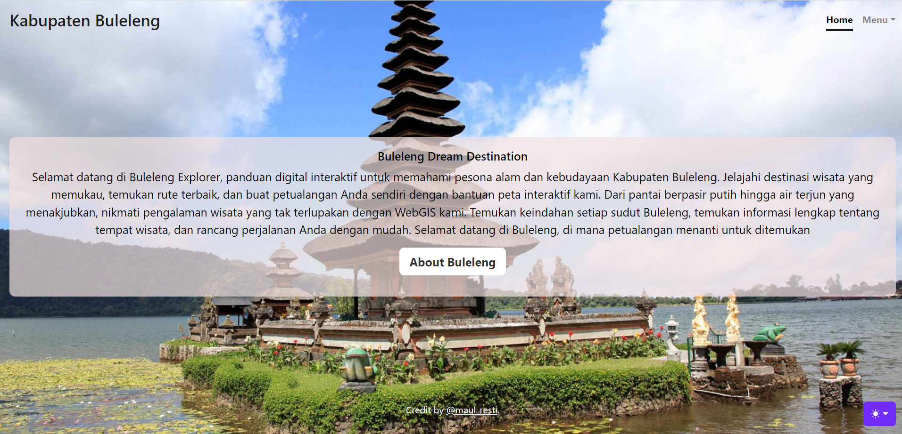
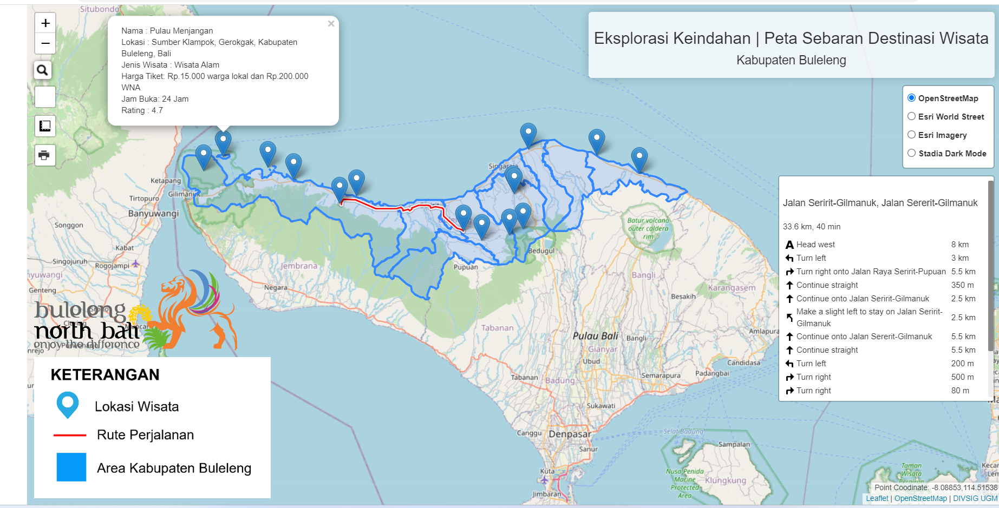
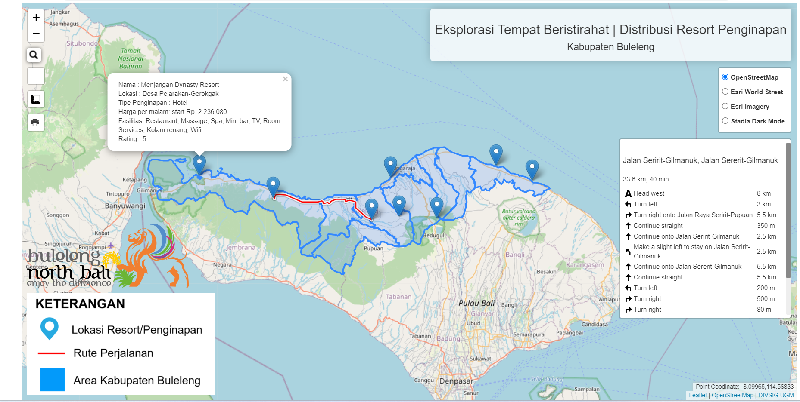

# pgweb-responsi
<h2> Buleleng Dream Destination : Eksplorasi Wisata Kabupaten Buleleng, Bali </h2>
<h2> Deskripsi produk </h2>

Buleleng Dream Destination merupakan platform WebGIS yang memandu Anda dalam petualangan tak terlupakan melalui keindahan alam dan budaya Kabupaten Buleleng. Temukan pesona dan kekayaan destinasi wisata yang menakjubkan di Pulau Dewata Utara. Platform ini dilengkapi dengan Navigasi yang mudah melalui peta interaktif , sehingga memungkinkan Anda menjelajahi lokasi dan tempat menarik di Kabupaten Buleleng dengan sekali sentuhan. 

<h2> Komponen pembangun produk </h2>
<ul>
  <li>HTML: Menyediakan kerangka dasar untuk membangun konten dan struktur halaman web.</li>
  <li>CSS: Mengontrol tampilan elemen HTML serta tata letak dan desain halaman web.</li>
  <li>Leaflet.js Library: Library JavaScript yang digunakan untuk menghassilkan peta interaktif.</li>
  <li>Geoserver: Server GIS yang digunakan untuk menyimpan dan mengelola data geospasial.</li>
  <li>MySQL: Penyimpanan Database titik lokasi pada peta wisata dan peta resort/penginapan.</li>
  <li>XAMPP: Software opensource yang digunakan untuk menyediakan ekstensi Apache dan MySQL pada lingkungan pengembangan lokal agar memudahkan dalam membuat dan mengelola situs web secara dinamis.</li>
  <li>Integrasi Website Penginapan: Memberikan opsi kepada pengguna untuk menjelajahi dan memesan resort/penginapan yang diinginkan secara lebih lanjut.</li>
</ul>

<h2>Sumber Data:</h2>

<ul>
  <li><a
                    href="https://bulelengkab.bps.go.id/publication/2021/11/30/ce55208d0959cae7aa1c354d/statistik-pariwisata-kabupaten-buleleng-2020.html">Statistik
                    Pariwisata Kabupaten Buleleng 2020</a></li>
  <li>Data Shapefile Administrasi Kabupaten Buleleng </li>
  <li>Data Lokasi Koordinat Titik Lokasi Wisata dan Penginapan Kabupaten Buleleng yang diambil dari Google Maps dan Google Earth</li>
  <li>Database Penginapan dan Wisata Kabupaten Buleleng yang diambil dari Google Maps dan Sumber Website lain</li>
</ul>

<h2>Tangkapan Layar Komponen Penting</h2>
<ol>
  <li>Landing Page</li> 
  <li>Peta Sebaran Wisata (Integrasi WebGIS dan Database)</li> 
  <li>Peta Sebaran Resort/Hotel  (Integrasi WebGIS dan Database) </li> 
</ol>
